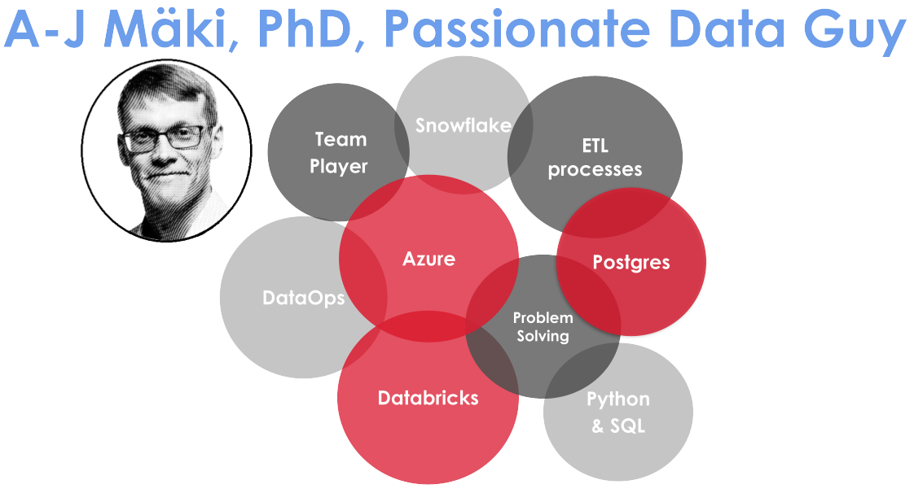

# A-J Mäki, PhD: Data Engineer & Passionate Data Nerd
Welcome to my personal website. 
I am a passionate data nerd, cross-skiing fanatic, and football fan. 
Currently, working as data engineer @[Solita](https://www.solita.fi/)
<!-- ## Portfolio CV -->
My work portfolio page can be found [here](https://anahill.github.io/portfolio/).

<!-- badges of tools -->

<!-- , where I have gathered together my 
- Work portfolio 
- Academic portfolio
- Projects -->

<!-- separate current portfolio and academic portfolio -->

Academic portfolio showing my research outcomes is 
coming soon.

## Projects
- See [DatAnalyzer](https://github.com/AnaHill/DatAnalyzer), my data analysis project using **MATLAB** 

**Visitor's count**

   
  

