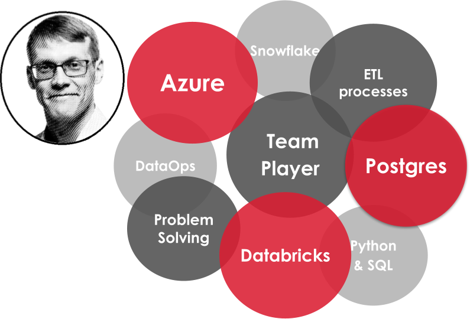

<!-- # A-J Mäki, PhD: Data Engineer & Passionate Data Nerd -->

<!-- Please be freely to check my codes -->
<!-- # 👋 Welcome! I'm **A-J Mäki** -->

Hi, I'm **A-J Mäki**—a curious mind with a passion for **data, sports, and lifelong learning**. Welcome to my home pages.  

## 🚀 **About Me**  

- 🤓 **Data Nerd** – Always finding resilient solutions that can make impact   
- ⛷️ **Cross-Country Skiing Fanatic** – Nothing beats the thrill of the trails  
- ⚽ **Football Enthusiast & Family Man** – Passionate about the game on and off the field  

## 🔍 **Explore More**  
Currently, I work as a **Data Engineer [@Solita](https://www.solita.fi/)**. Check <a href="https://anahill.github.io/portfolio/" class="green-text">**🤓My Work Portfolio**</a> to find out more.
 

  

<!-- 
 -->

Before transitioning into the world of data, I had a long and diverse academic career. Dive into
<a href="https://anahill.github.io/academic-portfolio/" class="red-text">**👨‍🔬My Academic Portfolio**</a> to explore my research.  

## Projects & Blogs
<strong>⚡ This section is under construction!</strong>  

I enjoy working on hobby projects, most of them can be found in my **[GitHub repositories](https://github.com/AnaHill?tab=repositories)**. Check out for example:  

🔍 **[DatAnalyzer](https://github.com/AnaHill/DatAnalyzer)** – A data analysis tool built with **MATLAB**

📊 **Visitor's count**

   
  

