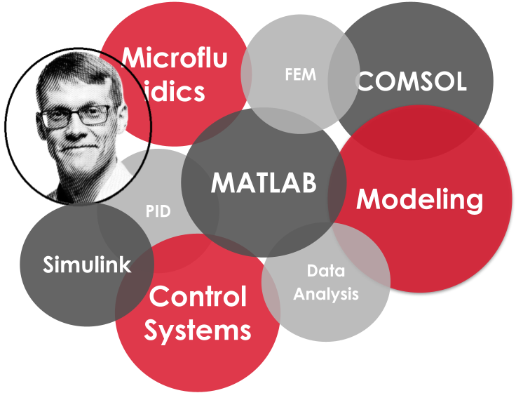
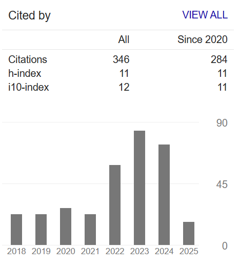

# 👨‍🔬 Welcome to My Academic Portfolio  

Here, I showcase my **lifelong journey in science 🔬**, driven by *curiosity, continuous learning, and a deep passion for data*. I bring together a **strong academic background 👨‍🔬** with hands-on expertise in both **🛠️ data engineering and analysis 📈** — a true *data nerd* 🤓 at my ❤️! 

🔍 **Want to see what I do daily?**  
To learn more about my **current role as a Data Engineer** at [**Solita**](https://www.solita.fi/ "www.solita.fi"), check out [**👉🛠️ My Work Portfolio 👨🏻‍💻👈**]({{ "/work.html" | relative_url }} "my work portfolio")  

<a href="https://anahill.github.io/resume_ajm.pdf" target="_blank">📑 Click here to open my resume (pdf) </a>

---

<!-- ## NAVIGATOR -->

  <strong>🚀 Quick Navigation</strong> 

 Use the links below to jump to key sections!
<nav>
  <a href="#academic-work-experience" class="nav-link" title="My research and work experience">👉🔬 Research & 💼 Work History</a> 
   
  <a href="#projects" class="nav-link" title="Project that I have been working on">👉🗂️ Projects </a> 
   
  <a href="#publications" class="nav-link" title="My Publications listed">👉📝 Publications</a>
</nav>
<!-- ## NAVIGATOR ENDS-->

---

I’d love to hear from you! Whether you have an exciting research idea where I could contribute—because science is fun!🤓—or just want to discuss my work, feel free to reach me out.  

  
  
  
   

For more insights into my research, you can also contact **Professor Pasi Kallio** from Tampere University, who leads Micro- and Nanosystems Research Group. More about their pretty cool research can be found [here](https://research.tuni.fi/mst/). 

<!-- ############# -->
# 🎓Education
D. Sc. (Tech.), Tampere University of Technology, Sep 2018
- 📝 Doctoral dissertation '_Modeling and Control of Microscale Cell Culture Environments_' available [here](https://urn.fi/URN:ISBN:978-952-15-4174-2 "trepo.tuni.fi")

My Ph.D. work involved designing and implementing control systems, mathematical modeling and data handling using MATLAB and Simulink, FEM simulations with COMSOL, and laboratory work with microfluidics chips.

M. Sc. (Tech.), Tampere University of Technology, July 2010  
- 📝 Thesis '_Optically induced electric fields and their use in microfluidics and cell manipulation applications_' is available [here](https://urn.fi/URN:NBN:fi:tty-201008171286 "trepo.tuni.fi") and was presented in the 2nd European Conference on Microfluidics-Microfluidics 2010, Toulouse, December 8-10, 2010. 

<!-- ############# WORK ############# -->
#  💼 My Research & Work Experience
Summarizing 15+ years in academia? Not the easiest task... but let's try! 😆  
- **tl;dr**: My 👨‍🔬 research focused on **control engineering**, **microfluidics**, **mathematical modeling** using both *Simulink & MATLAB* and *FEM* (*COMSOL*), and **data analysis** with *MATLAB*. Without forgetting _some_ 😎 hours of laboratory work 👨🏻‍🔬🔬. 

  More information on 
  
  
  

---

## 💡 Lifelong Researcher & Passionate Hobby Scientist (_Jan 2025 – Present_)  
Currently, I focus on continuous learning and on my hobby projects, some of them listed below. But, please do not hesitate to contact me if you would have some research study in your mind. 👨‍🔬

**NOTE**: 
These are projects I’m actively working on—whether they’ll ever be *truly* finished is another story! 🤓 I also 📝 [started blogging](https://anahill.github.io/blog/), and these will likely be my first topics. Stay tuned! ✍️  

<strong><big> My Tips for Academy </big></strong>
- Sharing my tips & tricks for the academic career. For example, how to make "version control" clever in the case of you are not familiar with git etc 👉 check [link](https://github.com/AnaHill/Tips-for-Academy)

<strong><big> How to write scientific papers </big></strong>
- A follow-up to my [Write LaTeX Documents using Word](https://github.com/AnaHill/Write-LaTeX-documents-using-Word) guide, this post explores how you can leverage **VS Code, Markdown, Pandoc, LaTeX, and BibTeX** to efficiently format and publish high-quality (scientific) papers  link coming soon(ish)
- **P.S.** 🚀 *Effortless writing not guaranteed—but at least the workflow is smooth(er)!* 🤓  

<strong><big> How to set up Python environments for data projects </big></strong>
- My proposal how to set up Python environment for (hobby) data projects by combining  **Miniconda, pip, VS Code,...** 👉 check [link](https://github.com/AnaHill/How-to-set-up-Python-environments-for-data-projects)

<!-- ### Part-Time Researcher  / Visiting Scholar ### -->
## 🤓 Visiting Scholar @Tampere University (_Nov 2022 - Dec 2024_)
Continued as a part-time researcher (approx. 10 hours/month) in [Micro- and Nanosystems Research Group](https://research.tuni.fi/mst/) led by Professor Pasi Kallio.
- **🚀 Research areas**: lab-on-a-chip, vascularization, data analysis, fuzzy control
- **🛠️ Main tools**: MATLAB, Simulink, COMSOL (FEM)

During this time, we finished following three publications 📝.

> 🚀  *Bringing the future of tissue engineering one step closer!* 🧫 

I led a **multidisciplinary research team** that developed a groundbreaking **"body-on-a-chip" platform** for studying vascularized **3D cell co-cultures**. Our team introduced an **innovative open-top microfluidic chip** that enables the cultivation of **two distinct 3D cell cultures** within a single device—**without physical barriers**. This breakthrough technology opens new possibilities for **studying cell-cell interactions** in a precisely controlled microenvironment and advancing **drug testing** applications. Read more: 

  
    
      
        
          <strong>{{ author }}</strong>
        
          {{ author }}
         and 
      .
      <em>"{{ pub.title }}"</em> {{ pub.journal }}, {{ pub.year }}. doi: <a href="https://doi.org/{{ pub.doi }}">{{ pub.doi }}</a>
         
    
  

> 🎚️  *Control the beating of cardiomyocyte cultures - by temperature!* 🌡️  

I developed **fuzzy controllers and mathematical models to simulate and control temperature-dependency of beating human cardiomyocyte cultures**. This research offers valuable guidance for scientists aiming to **standardize experimental conditions** and **improve the reliability of cardiomyocyte cell cultures**. Read more: 

  
    
      
        
          <strong>{{ author }}</strong>
        
          {{ author }}
         and 
      .
      <em>"{{ pub.title }}"</em> {{ pub.journal }}, {{ pub.year }}. doi: <a href="https://doi.org/{{ pub.doi }}">{{ pub.doi }}</a>
         
    
  

> 📈 *Truely understand the field potential signals* 📊 

I encapsulated my extensive experience in **analyzing field potential (FP) signals derived from 2D human-induced pluripotent stem cell-derived cardiomyocyte (hiPSC-CM) cultures**. 

While developing the [**DatAnalyzer**](https://github.com/AnaHill/DatAnalyzer "DatAnalyzer") software, I observed a wide array of methodologies used for FP signal analysis across various studies. Driven by realization of this inconsistency, I dedicated significant effort to produce an academically rigorous report that—despite not undergoing formal peer-review process—offers valuable **insights and guidance for researchers analyzing FP signals**. More information on DatAnalyzer [**repo**](https://github.com/AnaHill/DatAnalyzer "DatAnalyzer repo") and in the following article: 

  
    
      
        
          <strong>{{ author }}</strong>
        
          {{ author }}
         and 
      .
      <em>"{{ pub.title }}"</em> {{ pub.journal }}, {{ pub.year }}. doi: <a href="https://doi.org/{{ pub.doi }}">{{ pub.doi }}</a>
         
    
  

<!-- ### Postdoc ### -->
## 👨🏼‍🎓 Postdoctoral Research Fellow @Tampere University (_Sep 2018 - Nov 2022_)
As a postdoc in Professor Pasi Kallio's [Micro- and Nanosystems Research Group](https://research.tuni.fi/mst/), I developed **data analysis methods for several challenging biosignals**. Additionally, I worked as Professor Kallio’s **Vice-PI in a multidisciplinary team** combining cell biologists and engineers, and led a group of researchers developing **a novel vascular-on-a-chip platform for 3D cell co-cultures**. More info on [**CoEBoC-project**](#coeboc) section.
- **🚀 Research areas**: lab-on-a-chip, data analysis, microfluidics, iPS-CM, fuzzy control
- **🛠️ Main tools**: soft lithography (PDMS), MATLAB, Simulink, COMSOL (FEM) 
<!-- now refs here, only linkin to coeboc? -->

## 👨‍🔬 Doctoral Researcher @Tampere University of Technology (_Sep 2011 - Aug 2018_)
My Ph.D. work in the multidisciplinary project involved  implementing automation and control systems, designing microfluidics chips, developing mathematical models, and handling data analysis using MATLAB, Simulink, and COMSOL. More info about the project on [**Human Spare Parts**](#hs) section.
- **🚀 Research areas**: microsystems, microfluidics, control engineering, heat control
- **🛠️ Main tools**: soft lithography, MATLAB, Simulink, COMSOL (FEM) 
- **📖 Thesis**: Dissertation '_Modeling and Control of Microscale Cell Culture Environments_' available [**here**](https://urn.fi/URN:ISBN:978-952-15-4174-2 "dissertation at trepo.tuni.fi").

## 🧑🏼‍🔬 Project Researcher @Tampere University of Technology (_Aug 2010 - Sep 2011_)
My study was related to immunoassay in microchannels and how they could be used in patient diagnostics.

## 🧑🏼‍🔬 Thesis Worker and Research Assistant @Tampere University of Technology (_June 2006 - Aug 2010_)
I worked in OPTIMI (Optically actuated microfluidics) project funded by Academy of Finland and collaborated with researchers from Helsinki University of Technology. My task was to model and test optically induced electric fields and to study how they could be used in microfluidics applications.
- 📖 Master thesis (2010), titled '_Optically induced electric fields and their use in microfluidics and cell manipulation applications_' is available [**here**](https://urn.fi/URN:NBN:fi:tty-201008171286 "msc thesis at trepo.tuni.fi") and was later presented 🗣 in the 2nd European Conference on Microfluidics-Microfluidics 2010, Toulouse, December 8-10, 2010

<!-- ############# Projects ############# -->
# 🗂️ Projects

## 🫀  CoEBoC (_2018 - 2025_) 
[**CoEBoC**](https://research.tuni.fi/coeboc/ "CoEBoC, Centre of Excellence in Body-on-Chip Research"), '_Centre of Excellence in Body-on-Chip Research_', is Academy of Finland funded project for the years 2018-2025. The ultimate goal of CoEBoC is to **revolutionize healthcare by developing and applying Body-on-Chip (BoC) technologies** and enable more accurate and efficient drug testing, as well as by discovering new tools for diagnosing and treating diseases at the cellular level.

CoEBoC brought together six research groups from Tampere University: microsystems and microfluidics, biomaterials, adult stem cell research, cardiac and neural cell cultures, and computational biophysics and imaging.

- **⚡Own role**: Postdoctoral Researcher, Vice Principal Investigator (Vice-PI), project lead in [**Vascularized Body-on-Chip development**](#vascularization "3D vascularized chip") 
- **🚀 Research areas**: microfluidics, numerical simulations (FEM), data analysis, control engineering, cardiomyocyte culture, vascularization

  
<strong>Show Selected Articles</strong>
  
  

    
      
        
          
            <strong>{{ author }}</strong>
          
            {{ author }}
           and 
        .
        <em>"{{ pub.title }}"</em> {{ pub.journal }}, {{ pub.year }}. doi: <a href="https://doi.org/{{ pub.doi }}">{{ pub.doi }}</a>
           
      
    
  

## 🦾  Human Spare Parts (_2011 - 2019_) 
In this Business Finland (former TEKES) Human Spare Parts - project (2011-2019), the goal was to develop stem cell-based advanced in vitro models and solutions for cardiac, neural, bone, and adipose diseases and traumas. It combined tens of experts from different research fields, such as microsystems, stem cells, biomaterials, and biomedical engineering, and produced several leading edge _in vitro_ models and solutions.

- **⚡Own role**: Doctoral Researcher
- **🚀 Research areas**: microsystems, numerical simulations (FEM), control engineering

<!-- ### Repos/Other project ### -->
## 👨‍💻 Own projects
Here, I list some of my research projects I have created during my academic career.

<!-- DatAnalyzer -->
> 🚀 <strong><big> DatAnalyzer: The correct way to analyze FP signals 📊 </big></strong>

- ⚡ **Role:** Creator
- ✅ **Key Contributions:** Developed tools to load, analyze, and visualize data, especially electrical biosignals
- 🛠️ **Tech Stack:** MATLAB
- 🏷️ **Key Words:** data analysis, MEA, field potential, hiPS-CM
- 🔗 **References:** [DatAnalyzer home page](https://github.com/AnaHill/DatAnalyzer "DatAnalyzer repo") and publication _Opinion: The correct way to analyze FP signals_ in [Zenodo](https://doi.org/10.5281/zenodo.10205591)

I developed **DatAnalyzer** software to analyze field potential (FP) signals from human induced pluripotent stem cells derived cardiomyocyte (hiPSC-CM) cultures. Furthermore, I summarized how FP signals have been analyzed various, sometimes even contradictory, ways in the literature, and proposed new methdod for the proper analysis.

  
<strong> List of Publications using DatAnalyzer</strong>
  
  

    
      
        
          
            <strong>{{ author }}</strong>
          
            {{ author }}
           and 
        .
        <em>"{{ pub.title }}"</em> {{ pub.journal }}, {{ pub.year }}. doi: <a href="https://doi.org/{{ pub.doi }}">{{ pub.doi }}</a>
           
      
    
  

 

---

<!-- DocLaTex -->
> 🚀 <strong><big> Write LaTeX documents together with co-authors that use MS Word ✍️</big></strong>
- ⚡ **Role:** Creator
- ✅ **Key Contributions:** Developed conversion tool to work with MS Word using Pandoc & Markdowns & LaTeX
- 🛠️ **Tech Stack:** Powershell, Pandoc, LaTeX, Markdown
- 🏷️ **Key Words:** automation, publish
- 🔗 **References:** [Project repo](https://github.com/AnaHill/Write-LaTeX-documents-using-Word "Write-LaTeX-documents-using-Word repo")  

Do you want to use LaTeX for your (scientific) paper, but struggling when co-authors, such as you supervisor, do not use it, thus Word is preferred? This is tool for you! Minimize hassle of exporting files in different formats and copy-paste text from one format to another, while still be able to write LaTeX-documents. And you are ready to publish high-quality papers like the following that was written using this tool! 😎

  
    
      
        
          <strong>{{ author }}</strong>
        
          {{ author }}
         and 
      .
      <em>"{{ pub.title }}"</em> {{ pub.journal }}, {{ pub.year }}. doi: <a href="https://doi.org/{{ pub.doi }}">{{ pub.doi }}</a>
    
  

---

> 🚀 <strong><big> Plot Fluke Ti400 thermal images 🌡️</big></strong>

- ⚡ **Role:** Creator, co-author
- ✅ **Key Contributions:** Plot thermal images for the analysis
- 🛠️ **Tech Stack:** MATLAB, PowerShell, thermal images
- 🏷️ **Key Words:** automation, publish
- 🔗 **References:** [Project repo](https://github.com/AnaHill/Plot_Fluke_Ti400_thermal_images "Plot Fluke thermal images using MATLAB repo")  

In the following publication, thermal images from Fluke Ti400 device were plotted using this tool.

  
    
      
        
          <strong>{{ author }}</strong>
        
          {{ author }}
         and 
      .
      <em>"{{ pub.title }}"</em> {{ pub.journal }}, {{ pub.year }}. doi: <a href="https://doi.org/{{ pub.doi }}">{{ pub.doi }}</a>
    
  

<!-- Languages and merits -->
# Languages and merits  
## Language
- Finnish: Mother tongue
- English: C2 (full professional working proficiency)
- Swedish: A2
- German: A1
- Mandarin: A1

## Academic Merits
- Invention disclosures
  - TKS0222022 Kudosteknologisen lihaskimpun kehikko (”_Frame of an engineered skeletal muscle bundle_”), granted 08/2022 (second author)
  - TKS0222021 MEA-signaalin analyysityökalu (”_MEA analysis tool_”), granted 05/2021
  - TKS0612020 Pilarivapaa 3D monisolukasvatuschippi (”_Barrier-free 3D co-culture chip_”), granted 06/2020
- Member of the Organizing Committee, Nordic Organ on a Chip Symposium 2019, 08/2019
- Member of Future Finders network, Tampere University 2019-2022
- Doctoral Programme of the President of the Tampere University of Technology, 09/2021 – 08/2015; personal salary

<!-- ############# -->
# 📝 Publications

  In this section, I list my journal articles; for more information, e.g. see my conference papers, check also the following links
  
  

<figure style="text-align: left;">
  
  <figcaption><em>Google Scholar Profile Statistics – March 2025 </em></figcaption>
</figure>

## Selected Articles
To highlight my academic work, I have chosen following articles that are listed below.

This is my first paper where I was the last author. We developed a novel, vascularized 3D chip, see more in [**Vascularized Body-on-Chip development**](#vascularization "3D vascularized chip"). 

  
    
      
        
          <strong>{{ author }}</strong>
        
          {{ author }}
         and 
      .
      <em>"{{ pub.title }}"</em> {{ pub.journal }}, {{ pub.year }}. doi: <a href="https://doi.org/{{ pub.doi }}">{{ pub.doi }}</a>
         
    
  

I developed fuzzy controllers and created a simulation environment and mathematical models, see more in [**Control the beating of cardiomyocyte cultures**](#fuzzy_control "fuzzy control environment").

  
    
      
        
          <strong>{{ author }}</strong>
        
          {{ author }}
         and 
      .
      <em>"{{ pub.title }}"</em> {{ pub.journal }}, {{ pub.year }}. doi: <a href="https://doi.org/{{ pub.doi }}">{{ pub.doi }}</a>
         
    
  

### Selected Articles listed

  
<strong>📝 Show Selected Journal Articles </strong>
  

  
    
      
        
          <strong>{{ author }}</strong>
        
          {{ author }}
         and 
      .
      <em>"{{ pub.title }}"</em> {{ pub.journal }}, {{ pub.year }}. doi: <a href="https://doi.org/{{ pub.doi }}">{{ pub.doi }}</a>
         
    
  

# All Journal Articles
Click below to see list of all journal articles I am involved in.

  
<strong>📚 Show All Journal Articles</strong>
  
  

    
        
          
            <strong>{{ author }}</strong>
          
            {{ author }}
           and 
        .
        <em>"{{ pub.title }}"</em> {{ pub.journal }}, {{ pub.year }}. doi: <a href="https://doi.org/{{ pub.doi }}">{{ pub.doi }}</a>
           <!-- Add a small break between references -->
    
  

---

<a href="{{ site.baseurl }}/" style="color:green">
  <strong><big>⬅ To My Main Page </big> </strong>
</a>