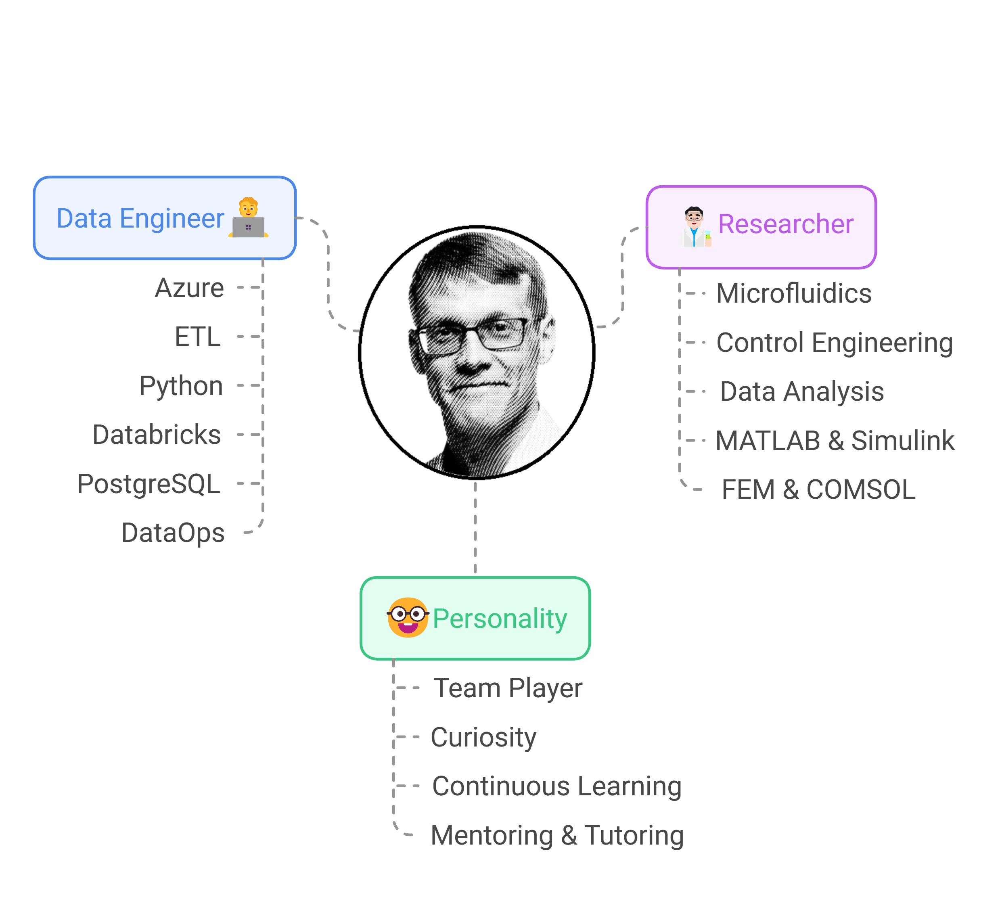

> 😎 Nerd your day! 🤓  

Welcome to my home pages. I'm **A-J Mäki**, PhD

  

# 🚀 About Me  

- 🤓 **Data Nerd** – Always finding resilient data solutions that can make _positive_ impact   
- ⛷️ **Cross-Country Skiing Fanatic** – ☀️winter days & cross-country skiing is just so 😎  
- ⚽ **Football Enthusiast & Family Man** 👪 – Passionate about the game on and off the field  

<figure style="text-align: center;">
  
  <figcaption><em>"A-J Mäki – 🤓 Data enthusiast with a passion for mentoring and continuous learning."</em></figcaption>
</figure>

# 🔍 Explore More  
Currently, I work as a **Senior Data Engineer [@Siili Solutions](https://www.siili.com/)**. 
To find out more my skills, tools, and projects, check [**👉🤓My Work Portfolio🛠️👈**]({{ "/work.html" | relative_url }} "my work portfolio")  
<a href="https://anahill.github.io/resume_ajm.pdf" target="_blank">📑 Click here to open my resume (pdf) </a>

  💼 Reach me via  
   
  
  
  

Before transitioning into the data consultant, I had a long and diverse academic career, which I have summarized in 
[**👨‍🔬My Academic Portfolio**]({{ "/academic.html" | relative_url }} "my academic portfolio").

# 📂 Projects
I have list my work-related projects <strong>👉[here](work.html#projects) </strong>.
On the other hand, I enjoy working on hobby projects, most of them can be found in my **[GitHub repositories](https://github.com/AnaHill?tab=repositories)**. Check out for example:  

🔍 📈 **DatAnalyzer** ([repo](https://github.com/AnaHill/DatAnalyzer "DatAnalyzer")) – A data analysis tool built with **MATLAB**, described [**here**](academic.html#datanalyzer).

🔍 📝 **DocLaTex** ([repo](https://github.com/AnaHill/Write-LaTeX-documents-using-Word)) – Write LaTeX documents together with co-authors that use only MS Word, more info [**here**](academic.html#doclatex).

# 📝  Blogs 

I share my thoughts from time to time; my latest posts are following:  

<ul>
  
    <li>
      <a href="{{ post.url | relative_url }}">{{ post.title }}</a>  
      <em>({{ post.date | date: "%B %d, %Y" }})</em>
    </li>
  
</ul>

See all my blog posts **👉[here](/blog/)**   

---

<strong><big> 📊 Visitor's count </big></strong>

  

