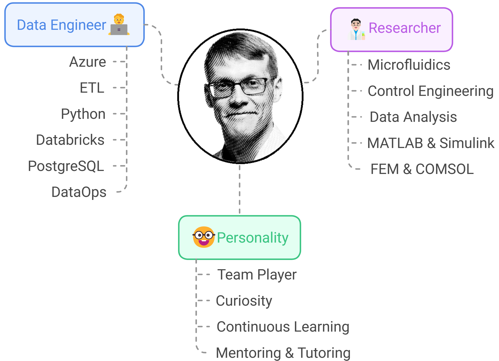

Welcome to my home pages. I'm **A-J Mäki**, PhD

  

## 🚀 About Me  

- 🤓 **Data Nerd** – Always finding resilient solutions that can make impact   
- ⛷️ **Cross-Country Skiing Fanatic** – Winter & cross-country skiing is just so 😎 
- ⚽ **Football Enthusiast & Family Man** – Passionate about the game on and off the field  

<figure style="text-align: center;">
  
  <figcaption><em>"This is me 🤓 – Data Engineer with a passion for data, research, and continous learning & teaching." </em></figcaption>
</figure>

## 🔍 Explore More  
Currently, I work as a **Data Engineer [@Solita](https://www.solita.fi/)**. 
To find out more my skills, tools, and projects, check [**👉🤓My Work Portfolio🛠️👈**]({{ "/work.html" | relative_url }} "my work portfolio")

  

Before transitioning into the data consultant, I had a long and diverse academic career, which I have summarized in 
[**👨‍🔬My Academic Portfolio**]({{ "/academic.html" | relative_url }} "my academic portfolio").

## 📂 Projects
<strong>⚡ This section is under construction!</strong>  

I have list my work-related projects <strong>👉[here](work.html#projects) </strong>.
On the other hand, I enjoy working on hobby projects, most of them can be found in my **[GitHub repositories](https://github.com/AnaHill?tab=repositories)**. Check out for example:  

🔍 📈 **DatAnalyzer** ([repo](https://github.com/AnaHill/DatAnalyzer "DatAnalyzer")) – A data analysis tool built with **MATLAB**, described [**here**](academic.html#DatAnalyzer).

🔍 📝 **DocLaTex** ([repo](https://github.com/AnaHill/Write-LaTeX-documents-using-Word)) – Write LaTeX documents together with co-authors that use only MS Word, more info [**here**](academic.html#DocLaTex).

## 📠 Blogs 

I share my thoughts from time to time; my latest posts are following:  

<ul>
  
    <li>
      <a href="{{ post.url | relative_url }}">{{ post.title }}</a>  
      <em>({{ post.date | date: "%B %d, %Y" }})</em>
    </li>
  
</ul>

See all my blog posts **👉[here](/blog/)**   

## 📊 Visitor's count

   
  

