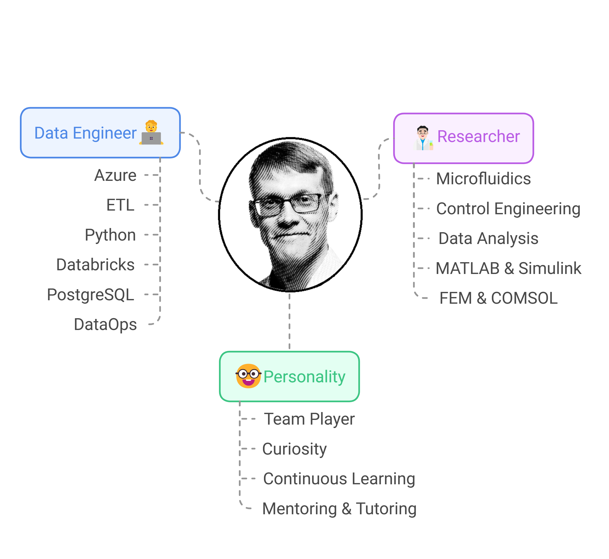
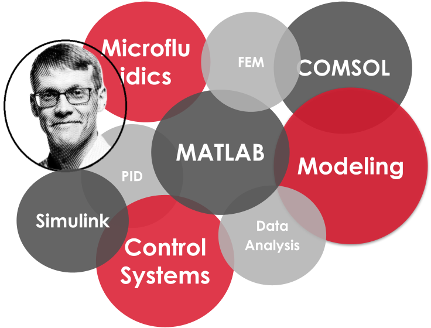

# TODO:
- several to do things, mainly in Finnish or Finglish (mix of Finnish and English)

## index.md
- [ ] rivit 21 --> piirrä esim mermaidilla profiilikuva
- [ ] puuttuu Fabric

<figure style="text-align: center;">
  
  <figcaption><em>"A-J Mäki – 🤓 Data enthusiast with a passion for mentoring and continuous learning."</em></figcaption>
</figure>

## work.md: piirrä paremmin
- [ ] piirrä omat taidot paremmin, rivi 41 -> 

### Promptikehotusta
Muutetaan tämä
[my_expertise](pics/ajm_de_bubble.png)

tehdään chart.js, alussa kuplien koko voi olla sama mutta pitää olla mahdollisuus kasvattaa tiettyjen kuplien kokoa. eli kaikki pitää toimia dynaamisesti

kuvassa on 3 eri kategoriaa
- tekkistakki
- konsultaatiotaidot
- toisarvoiset tekkistakki

Nämä ovat seuraavia. voit ehdottaa värejä halutessasi

Tekkistakki
- korostetuin, nyt punaisella. 
- isoimmat kuplat
- kuplia 4 kpl, termeinä
  - Azure
  - Databricks
  - Fabric
  - ETL processes

Konsultaatiotaidot
- nyt tummanharmaana
- isohkot kuplat
- kuplia 3 kpl, termeinä
  - Problem solving
  - Team player
  - Mentoring

toisarvoiset tekkistakki
- vaaleanharmaana
- pienimmät kuplat
- kuplia 4 kpl, termeinä
  - GenAI
  - Snowflake
  - DataOps
  - Python & SQL

## academic.md
- [ ] voisiko piirtää mermaidilla tms tämän buble kuvan riviltä 91 -> 

