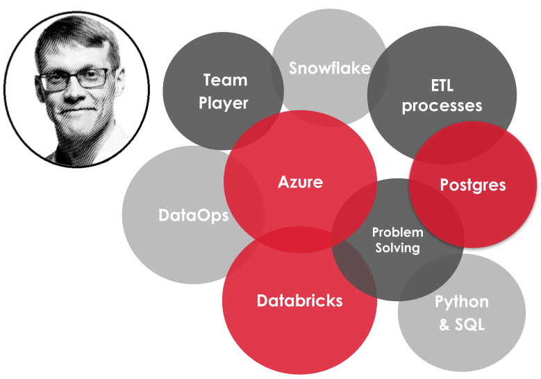

# 🤓 Welcome to My Work Portfolio  

Passionate and experienced data guy. Currently, working as a **Data Engineer [@Solita](https://www.solita.fi/)** and building resilient data solutions for the customers using modern cloud platforms and tools like **Azure** (especially **Azure Data Factory** and **Azure DevOps**), **Databricks**, **Python**, and **PostgreSQL**.

  💼 Reach me via:  
   
  
  
  

# 🛠️ Skill & Tools
<!-- <strong>⚡ This section will be updated soon!</strong>   -->
As the saying goes, a picture is worth a thousand words. Here’s a visual summary of my skills and the tools I use.
<!-- 

  
  

 
-->

**Other Technical Skills**: MATLAB, Simulink, COMSOL (FEM), git, Powershell, Crosser, Markdown, bash, Linux (Ubuntu/WSL)

I am an analytical professional with a strong background in mathematics and data analysis. Over 15+ years in academia, I have developed mathematical models using FEM/COMSOL and MATLAB & Simulink, conducted data analysis with MATLAB, and designed various control systems, including those utilizing fuzzy controllers.

# Education
- D. Sc. (Tech.), Tampere University of Technology, Aug 2018
- M. Sc. (Tech.), Tampere University of Technology, July 2010

# Work Experience

## 👨‍💻 Data Engineer [@Solita](https://www.solita.fi/) (_March 2023 - Present_)
- Building robust and scalable data solutions for customers
- Main tools and technologies: **Azure**, especially **Data Factory** and **DevOps**, **Databricks**, **PostgreSQL**, **Python**
- Also worked with **Snowflake**, **Crosser** and IIoT data, **Docker**, **git**, and write small **Powershell** and **bash** scripts.

## 👨‍💻 Data Engineer @Futurice (_Oct 2022 - Feb 2023_)
- I started my career shift from academia to the world of data consultant. Intensive learning, [certifications](#Certifications), and customer work in retail industry. 

## 👨‍🔬 Academy - Various Positions, Tampere University (_2006-2022_)
See full records in [👉**My Academic Portfolio**👈]({{ "/academic.html" | relative_url }} "my academic portfolio"). Below is a summary of my three most recent positions.

### 🤓 Visiting Scholar @Tampere University (_Oct 2022 - Dec 2024_, part time)
Continued as a part-time researcher (approx. 10 hours/month) in [Micro- and Nanosystems Research Group](https://research.tuni.fi/mst/) led by Professor Pasi Kallio.
- **Research areas**: Lab-on-a-chip, data analysis, vascularization, fuzzy control
- **Main tools**: MATLAB, Simulink, COMSOL (FEM)

### 👨🏼‍🎓 Postdoctoral Research Fellow @Tampere University (_Sep 2018 - Oct 2022_)
- **Research areas**: Lab-on-a-chip, data analysis, microfluidics, iPS-CM, fuzzy control
- **Main tools**: Soft lithography, MATLAB, Simulink, COMSOL (FEM) 

### 👨‍🔬 Doctoral Researcher @Tampere University of Technology (_Sep 2011 - Aug 2018_)
- **Research areas**: Microsystems, microfluidics, control engineering
- **Main tools**: Soft lithography, MATLAB, Simulink, COMSOL (FEM) 

<!-- Certs -->
# Certifications
Full list available in [Credly](https://www.credly.com/users/antti-juhana-maki).
- *Feb 2024* Agile Data Engine -- Agile Data Engine for Data Engineers 
- *Nov 2022* Azure -- Azure AI Fundamentals (AI-900)
- *Nov 2022* Azure -- Azure Data Fundamentals (DP-900)
- *Nov 2022* Azure -- Azure Fundamentals (AZ-900)
- *Dec 2022* AWS -- AWS Certified Cloud Practitioner
- *Oct 2022* Scrum -- Professional Scrum Master I (PSM I)

# Projects
<!-- current -->
## Data Engineering Services | Private Company, Finland (NDA)  
📅 _March 2024 - Present_  
🚀 **Role:** Data Engineer  
🔌 **Industry:** Energy Sector | **Data:** Operational & Analytical  

### 🌟 Key Contributions:
- Building and maintaining a scalable **data platform** spanning both **data lakes** and **relational databases**.  
- Optimizing **data pipelines** to enhance performance and reliability.  
- Ensuring seamless **data integration** across multiple sources for analytics and operations.  
- Working with **time-series** data

### 🛠️ Tech Stack:
**Databricks, PostgreSQL, Azure, Azure Data Factory, Azure DevOps** 

<!-- Palloliitto -->
##  Data Engineering and Analytics Services| The Football Association of Finland ⚽︎  
📅 _Aug 2023 - Dec 2024_  
🚀 **Role:** Data Engineer and Data Analyst  
🔌 **Industry:** Sport Sector ⚽︎ | **Data:** Operational & Analytical  

### 🌟 Key Contributions:
- Providing data engineer and analytics services for the customer including **monitoring and maintaining ADF pipelines and small-scale development on Azure**.

### 🛠️ Tech Stack:
**Azure, Azure Data Factory, Azure CLI, Azure Functions, MySQL** 

<!-- IIoT -->
##  Industrial IoT Data Engineering Services | Collaboration with Nokia, Snowflake, and Crosser
📅 _Jan 2024 - Jun 2024_  
🚀 **Role:** Data Engineer and Data Analyst  
🔌 **Industry:** Industry 4.0 | **Data:** Operational  

### 🌟 Key Contributions:
- Developing methods to **collect and analyze Industrial IoT (IIoT) data by combining Nokia MX Industrial Edge, Crosser, and Snowflake with Streamlit**. Demo related to Industry 4.0 presented in 2024 Hannover Messe, more info [here](https://www.youtube.com/watch?v=PduTpPv9Iy8). 

### 🛠️ Tech Stack:
**Crosser, Snowflake, Streamlit, ELT** 

<!-- ML -->
## Developing Machine Learning Capabilities | Public sector organization in Finland (NDA)  
📅 _May 2023 - April 2024_  
🚀 **Role:** Machine Learning Engineer and Data Scientist  
🔌 **Industry:** Public Sector | **Data:** Analytical  

### 🌟 Key Contributions:
- Developing machine learning capabilities for the customer, using both supervised and unsupervised learning, created for example a supervised classification algorithm using Databricks for the customer ERP system. 

### 🛠️ Tech Stack:
**Databricks, AutoML, Snowflake, SQL, Python & Spark** 

<!-- Futurice -->
## Data Engineering Services | Finnish retail company (NDA)  
📅 _Dec 2022 - Feb 2023_  
🚀 **Role:** Data Engineer  
🔌 **Industry:** Retail Sector | **Data:** Operational

### 🌟 Key Contributions:
- Handling customer's operational data, mainly using Azure Data Factory and PostgreSQL, and was part of the team that was improving the system to fulfill the future needs of the customer. 

### 🛠️ Tech Stack:
**Azure, Azure Data Factory, PostgreSQL, Python, Databricks** 

<!-- Own -->
## Own projects (GitHub repo)
### 🔍 📈 **[DatAnalyzer](https://github.com/AnaHill/DatAnalyzer)**
_DatAnalyzer_: The correct way to analyze FP signals, is a data analysis tool built with **MATLAB**, more info [here](academic.html#DatAnalyzer).

### 🔍 📝 **[DocLaTex](https://github.com/AnaHill/Write-LaTeX-documents-using-Word)**
Write LaTeX documents together with co-authors that use only MS Word, combines **Powershell**, **Pandoc**, **LaTeX**, **Markdown**, more details [here](academic.html#DocLaTex).

## Blogging
I am blogging time-to-time:

<ul>
  
    <li>
      <a href="{{ post.url }}">{{ post.title }}</a>
    </li>
  
</ul>