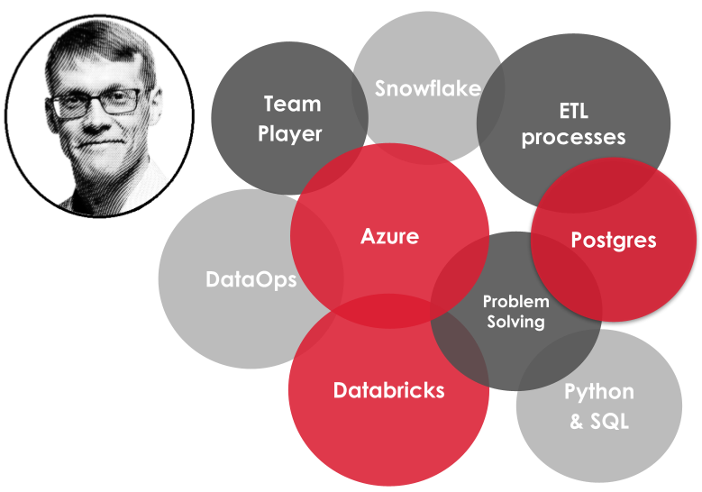

<a href="{{ site.baseurl }}/" style="color:green">
  <strong><big>⬅ To My Main Page </big> </strong>
</a>

# 🤓 Welcome to My Work Portfolio  

Passionate and experienced data guy 🤓 with a strong background in 🧮 mathematical modeling and 🎛️ control engineering. Currently, working as a **👨‍💻 Senior Data Engineer [@Siili](https://www.siili.com/)** and building resilient data solutions for the customers using modern cloud platforms and tools like **Azure** (especially **Azure Data Factory** and **Azure DevOps**), **Databricks**, **Python**, and **PostgreSQL**.

  💼 Reach me via  
   
  
  
  

<a href="https://anahill.github.io/resume_ajm.pdf" target="_blank">📑 Click here to open my resume (pdf) </a>

🔍 By the way, **Siili** is constantly looking for talented persons, check out our 👉 [**open positions**](https://www.siili.com/join-us#openpositions "open positions at Siili") 👈 or just drop me a message ✉︎. 

# 🛠️ Skill & Tools
As the saying goes, a picture is worth a thousand words. Here’s a visual summary of my skills and the tools I use.

<!-- 

  
  
  

 
-->

**Other Technical Skills**: MATLAB, Simulink, COMSOL (FEM), git, Powershell, Crosser, GitHub Pages, Markdown, bash, Linux (Ubuntu/WSL)

# Education
- D. Sc. (Tech.), Tampere University of Technology, Sep 2018
- M. Sc. (Tech.), Tampere University of Technology, July 2010

# Work Experience

## 👨‍💻 Senior Data Engineer [@Siili](https://www.siili.com/) (_Feb 2026 - Present_)
- Developing and maintaining robust and scalable data solutions for customers, both in data lake and relational databases; check my [**Projects**](#projects) section to find out more
- Main tools and technologies: **ETL / ELT**, **Azure**, especially **Data Factory** and **DevOps**, **Databricks**, **PostgreSQL**, **Python**
- Also working with **Fabric**

## 👨‍💼🎯🧠 GenAI Operational Accelerator – Tech Lead & Architect @Solita (_Sep 2025 – Jan 2026_)
- Led an in-house **agent-based (MCP server) innovation and development team** (7 members) as Technical Lead, Project Manager, and Scrum Master, collaborating closely with cross-functional stakeholders
- Designed the **MCP Reference Architecture** for internal GenAI accelerators

## 👨‍💻 Data Engineer @Solita (_March 2023 - Jan 2026_)
- Developing and maintaining robust and scalable data solutions, both in data lake and relational databases, for customers; check my [**Projects**](#projects) section to find out more
- Main tools and technologies: **ETL / ELT**, **Azure**, especially **Data Factory** and **DevOps**, **Databricks**, **PostgreSQL**, **Python**
- Also worked with **Snowflake**, **Fabric**, **Crosser** and IIoT data, **Docker**, **git**, and write small **Powershell** and **bash** scripts.

## 👨‍💻 Data Engineer @Futurice (_Oct 2022 - Feb 2023_)
- I started my career shift from academia to the world of data consultant. Intensive learning, five [certifications](#Certifications), and customer work in retail industry. 

## 👨‍🔬 Academy - Various Positions, Tampere University (_2006-2022_)
See full records in [👉**👨‍🔬 My Academic Portfolio**👈]({{ "/academic.html" | relative_url }} "my academic portfolio"). Below, I briefly summarize my postdoc era. In over 15+ years in academia, I developed mathematical models using FEM/COMSOL and MATLAB & Simulink, conducted data analysis with MATLAB, designed various control systems, including those utilizing fuzzy controllers, and developed microfluidics chips.

### 🤓 Visiting Scholar @Tampere University (_Oct 2022 - Dec 2024_, part time)
I continued as a part-time researcher (approx. 10 hours/month) in [Micro- and Nanosystems Research Group](https://research.tuni.fi/mst/) led by Professor Pasi Kallio.
- **Research areas**: Lab-on-a-chip, data analysis, vascularization, fuzzy control
- **Main tools**: MATLAB, Simulink, COMSOL (FEM)

### 👨🏼‍🎓 Postdoctoral Research Fellow @Tampere University (_Sep 2018 - Oct 2022_)
As a postdoc in Professor Pasi Kallio's [Micro- and Nanosystems Research Group](https://research.tuni.fi/mst/), I developed data analysis methods for several challenging biosignals. Additionally, I worked as professor Kallio’s Vice-PI in a multidisciplinary team combining cell biologists and engineers, and led a group of researchers developing a novel vascular-on-a-chip platform for 3D cell co-cultures.
- **Research areas**: Lab-on-a-chip, data analysis, microfluidics, iPS-CM, fuzzy control
- **Main tools**: Soft lithography, MATLAB, Simulink, COMSOL (FEM) 

<!-- Certs -->
# Certifications
See more info in [Credly](https://www.credly.com/users/antti-juhana-maki).
- *Aug 2025* Databricks -- Databricks Certified Data Engineer Associate
- *Feb 2024* Agile Data Engine -- Agile Data Engine for Data Engineers 
- *Nov 2022* Azure -- Azure AI Fundamentals (AI-900)
- *Nov 2022* Azure -- Azure Data Fundamentals (DP-900)
- *Nov 2022* Azure -- Azure Fundamentals (AZ-900)
- *Dec 2022* AWS -- AWS Certified Cloud Practitioner (recertified Dec 2025)
- *Oct 2022* Scrum -- Professional Scrum Master I (PSM I)

# 📂 Projects
<!-- current -->
<!-- food industry -->
## Data Engineering Services | Private Company, Finland (NDA)  
📅 _Apr 2026 - Present_  
🚀 **Role:** Lead Senior Data Engineer  
🔌 **Industry:** Food Industry | **Data:** Operational & Analytical  

### 🌟 Key Contributions
- Designing and building a scalable **data platform** in Microsoft Fabric  
- Lead developer with architectural responsibilities, leading a small development team

### 🛠️ Tech Stack
- Fabric (especially Lakehouses, shortcuts, notebooks, pipelines, Warehouses), Azure DevOps 

<!-- in-house -->
## GenAI Platform | Siili (In-house Project), Finland
📅 _Feb 2026 - March 2026_  
🚀 **Role:** Data & AI Engineer 
🔌 **Data:** Analytical  

### 🌟 Key Contributions
- Designed and implemented the **RAG POC** pipeline for internal modular LLM platform: SharePoint -> Azure Blob -> Azure AI Search (vector database)
- Azure infra work as well

### 🛠️ Tech Stack
- Azure, Azure CLI, Azure AI Search, Azure Data Factory, SharePoint

<!-- in-house -->
## GenAI Operational Accelerator | Solita (In-house Project), Finland
📅 _Sep 2025 - Jan 2026_  
🚀 **Role:** Tech Lead / GenAI Solutions Architect / Project manager / Scrum master  
🔌 **Data:** Operational & Analytical  

### 🌟 Key Contributions
- Led in-house **agent-based (MCP server) innovation and development efforts**, serving as Technical Lead, Project Manager, and Scrum Master
  - Team comprised of experienced software developers, a cloud engineer, and an IT specialist
- Designed and established the **MCP Reference Architecture** for internal GenAI accelerators
- Collaborated closely with multiple in-house stakeholders across business and technology domains

### 🛠️ Tech Stack
- Azure, Azure AI Search, Azure DevOps, Miro, Obsidian & Excalidraw

<!-- energy sector -->
## Data Engineering Services | Private Company, Finland (NDA)  
📅 _March 2024 - June 2025_  
🚀 **Role:** Data Engineer  
🔌 **Industry:** Energy Sector | **Data:** Operational & Analytical  

### 🌟 Key Contributions
- Building and maintaining a scalable **data platform** spanning both **data lakes** and **relational databases**.  
- Optimizing **data pipelines** to enhance performance and reliability.  
- Ensuring seamless **data integration** across multiple sources for analytics and operations.  
- Working with **time-series** data

### 🛠️ Tech Stack
- Databricks, PostgreSQL, Azure, Azure Data Factory, Azure DevOps

<!-- Palloliitto -->
##  Data Engineering and Analytics Services| The Football Association of Finland ⚽︎  
📅 _Aug 2023 - Dec 2024_  
🚀 **Role:** Data Engineer and Data Analyst  
🔌 **Industry:** Sport Sector ⚽︎ | **Data:** Operational & Analytical  

### 🌟 Key Contributions
- Providing data engineer and analytics services for the customer including **monitoring and maintaining ADF pipelines and small-scale development on Azure**.

### 🛠️ Tech Stack
- Azure, Azure Data Factory, Azure CLI, Azure Functions, MySQL

<!-- IIoT -->
##  Industrial IoT Data Engineering Services | Collaboration with Nokia, Snowflake, and Crosser
📅 _Jan 2024 - Jun 2024_  
🚀 **Role:** Data Engineer and Data Analyst  
🔌 **Industry:** Industry 4.0 | **Data:** Operational  

### 🌟 Key Contributions
- Developing methods to **collect and analyze Industrial IoT (IIoT) data by combining Nokia MX Industrial Edge, Crosser, and Snowflake with Streamlit**. Demo related to Industry 4.0 presented in 2024 Hannover Messe, more info [here](https://www.youtube.com/watch?v=PduTpPv9Iy8). 

### 🛠️ Tech Stack
- Crosser, Snowflake, Streamlit, ELT

<!-- ML -->
## Developing Machine Learning Capabilities | Public sector organization in Finland (NDA)  
📅 _May 2023 - April 2024_  
🚀 **Role:** Machine Learning Engineer and Data Scientist  
🔌 **Industry:** Public Sector | **Data:** Analytical  

### 🌟 Key Contributions
- Developing machine learning capabilities for the customer, using both supervised and unsupervised learning, created for example a supervised classification algorithm using Databricks for the customer ERP system. 

### 🛠️ Tech Stack
- Databricks, AutoML, Snowflake, SQL, Python & Spark

<!-- Futurice -->
## Data Engineering Services | Finnish retail company (NDA)  
📅 _Dec 2022 - Feb 2023_  
🚀 **Role:** Data Engineer  
🔌 **Industry:** Retail Sector | **Data:** Operational

### 🌟 Key Contributions
- Handling customer's operational data, mainly using Azure Data Factory and PostgreSQL, and was part of the team that was improving the system to fulfill the future needs of the customer. 

### 🛠️ Tech Stack
- Azure, Azure Data Factory, PostgreSQL, Python, Databricks

<!-- Own -->
## 📂 Own projects

### 🔍 📈 **DatAnalyzer** ([repo](https://github.com/AnaHill/DatAnalyzer "DatAnalyzer")) 
A data analysis tool built with **MATLAB**, described [here](academic.html#datanalyzer).

### 🔍 📝 **DocLaTex** ([repo](https://github.com/AnaHill/Write-LaTeX-documents-using-Word)) 
Write LaTeX documents together with co-authors that use only MS Word, combines **Powershell**, **Pandoc**, **LaTeX**, and **Markdown**, more info [here](academic.html#doclatex).

# 📊 Trainings 💻

## Industrial Data Hothouse - Solita, Solita
📅 _May 2023 - June 2023_  

In this 4-week long program, participants learned the concepts of industrial data and OT-IT convergence, edge computing and hybrid cloud in manufacturing and industrial data modelling and contextualization. We considered multiple technologies and partners, especially in Industrial IoT (IIoT) perceptive, for example Snowflake, Databricks, Crosser.io, Litmus, Nokia MX Industrial Edge, cybersecurity, Docker, OPC UA, and MQTT.

## Agile Data Engine (ADE) for Data Engineers, Agile Data Engine
📅 _April 2023 - April 2023_  

The key areas of this certificate are the following: 1) introduction to using ADE, 2) Hands-on training in a streamlined data warehouse project, 3) Comprehensive theory on ADE features and data modeling concepts.  After this one week training, participants can successfully import, model, and publish data.

# 📝 Blogging  
I share my thoughts from time to time (all posts 👉[here](/blog/)); my latest posts are following:  

<ul>
  
    <li>
      <a href="{{ post.url | relative_url }}">{{ post.title }}</a>  
      <em>({{ post.date | date: "%B %d, %Y" }})</em>
    </li>
  
</ul>

<a href="{{ site.baseurl }}/" style="color:green">
  <strong><big>⬅ To My Main Page </big> </strong>
</a>
